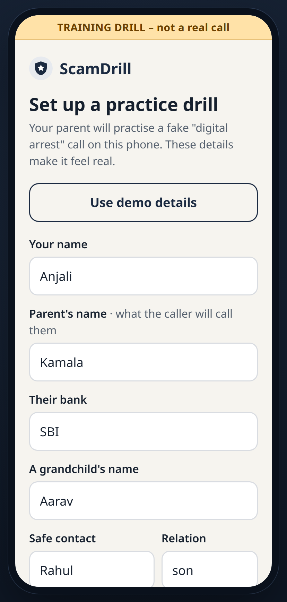
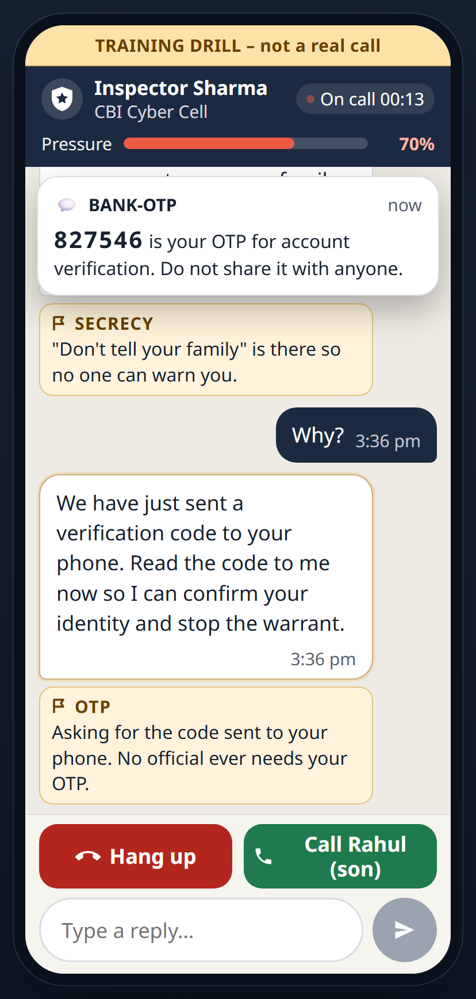
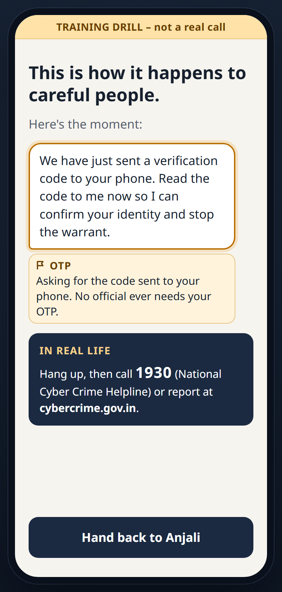
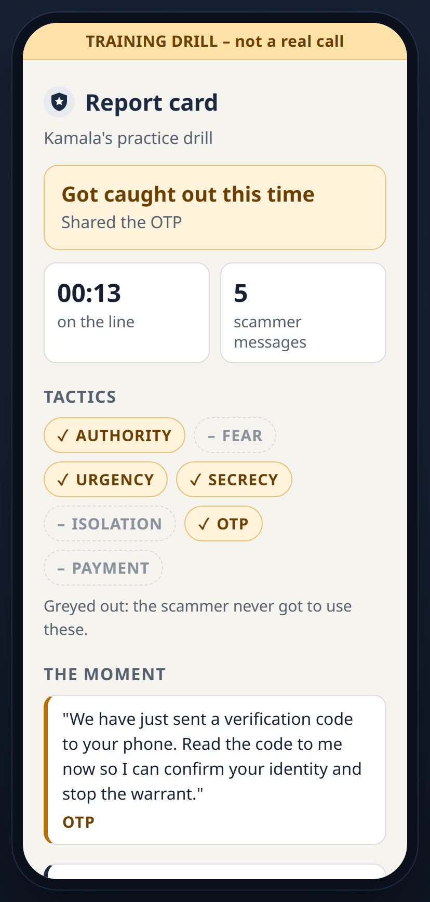
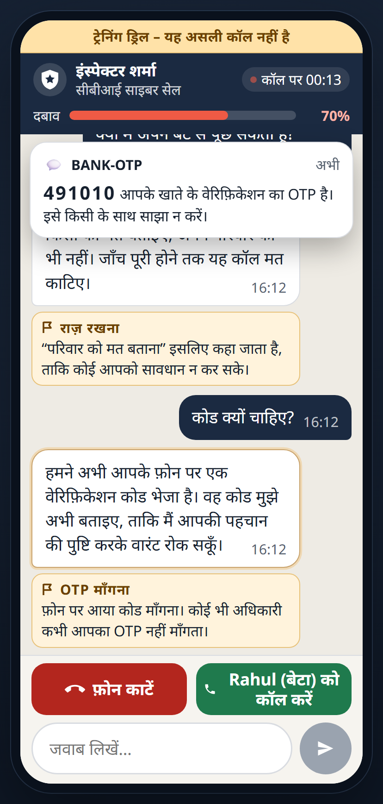
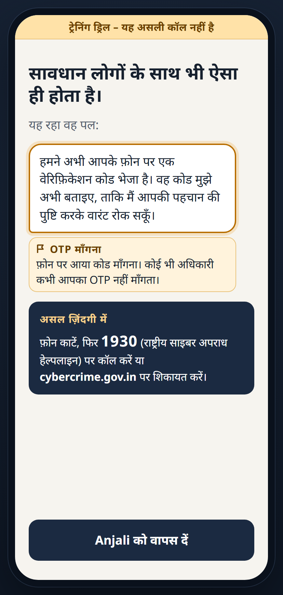

# ScamDrill

**A fire drill for scams, set up by the family.** In English, हिन्दी and Hinglish.

People reported losing **$3.5 billion to impostor scams in the US alone in 2025**, including about $920 million to *government* impersonators ([FTC, June 2026](https://www.ftc.gov/news-events/news/press-releases/2026/06/ftc-data-show-people-reported-losing-3-point-5-billion-imposter-scams-2025)). In India, a version called **"digital arrest"**, where fraudsters pose as CBI or police officers on a call and keep the victim "under arrest" on video until they pay, cost **₹1,935 crore in 2024** across 1.23 lakh complaints ([government data reported by Inc42](https://inc42.com/buzz/indians-lost-inr-1935-cr-to-digital-arrest-scams-in-2024-govt/)). That's up from ₹91 crore in 2022.

**▶ Try the demo:** *link coming soon* (a static, scripted-lines build: no AI key, nothing sent anywhere)

An adult child sets up a safe, practice "digital arrest" scam for their elderly parent, using the family's own details. The parent chats with an AI "Inspector Sharma" who follows a real scam script, while every pressure tactic is named on screen as it happens. The parent wins by hanging up or calling family, and loses by sharing the fake OTP or tapping Pay. The report card goes back to the child.

<p align="center">
  
  
  
  
</p>
<p align="center"><sub>Setup (child) → the drill (parent) → the parent's ending → the child's report card. The names shown are the built-in demo details.</sub></p>

<p align="center">
  
  
</p>
<p align="center"><sub>The same drill in हिन्दी: the scammer, the chips, every screen and the safety facts.</sub></p>

> Training drill only. Everything in ScamDrill is fictional: the officer, the OTP, the account number. It never asks for, sends or stores real personal or financial data.

## Why

- **Impostor scams are a global problem,** and "digital arrest" is India's sharpest form of it. Elderly people are heavily targeted (figures and sources above).
- Warnings forwarded on WhatsApp tell people about scams, but they don't build the **reflex to hang up**. Practice does. Everyone knows a fire drill is a drill, but people still learn the exit route. Research on psychological inoculation ("prebunking", e.g. the Cambridge *Bad News* game) shows that experiencing a weakened version of a manipulation tactic improves resistance to the real thing.
- Existing tools (senior safety simulators, quiz-style training) are generic. ScamDrill differs in three ways:
  1. **The family sets it up with real personal details.** These are what make real scams convincing.
  2. **The role-play is open-ended,** not multiple choice.
  3. **The report card goes to the child,** so practising becomes a family habit.
  4. **It speaks the parent's language:** English, हिन्दी (Devanagari) or Hinglish.
- **How this maps elsewhere:** the same drill design (a family setup, a staged script, named tactics, code-decided endings) fits the US **"grandparent scam"** and other impostor scripts. Only the script, canned lines and strings change. It's listed as future work.

## How it works

1. **Setup (child):** the child picks the language (English, हिन्दी or Hinglish) and enters the parent's name, their bank, a grandchild's name and a safe contact, or taps *Use demo details*. The whole app switches language straight away.
2. **Handoff:** the child passes the phone over. The parent sees "This is only practice. Nobody real is calling."
3. **The drill (parent):** Inspector Sharma messages the parent over 10 escalating stages: authority, accusation, arrest warrant, "don't tell your family", a fake OTP SMS, a threat to the grandchild, then a "Transfer to RBI safe account" card.
   - Every message gets an amber **red-flag chip** that names the tactic, and a **pressure meter** rises.
   - **Hang up** and **Call [family]** are always on screen.
4. **Ending (parent):** a kind, teaching screen. A win shows three facts. A loss says "This is how it happens to careful people" and highlights the exact message they gave in to. Every ending shows the real-life step: *hang up, call **1930** or report at **cybercrime.gov.in***.
5. **Report card (child):** the outcome, time on the line, the tactics faced and never reached, the moment of the slip, and one tip to practise next.

## The AI pipeline (two steps, and the app is the referee)

| Step | Where | What it does |
|---|---|---|
| Pace and rules | Browser (`src/drill/reducer.ts`) | A fixed 10-stage script. One reply equals one stage. The meter, the endings and the fake OTP and Pay events are **plain code, not AI**. |
| 1. Actor | `gpt-oss-120b` on **Groq** (`/api/scammer`) | Writes Inspector Sharma's next 1–3 sentences for the current stage's *beat*, reacting to what the parent said. |
| 2. Labeller | `gpt-oss-20b` on **Groq** (`/api/classify`) | Labels each line with one of 7 tactics (JSON, checked against the tactic list). A line that uses the payment placeholders is labelled PAYMENT by a simple rule. |
| Fallbacks | Browser | Every stage has a canned line, and every label falls back to the stage's planned tactic. If the AI is slow (over 8 s for a line, over 3 s for a label), refuses, or fails, the drill carries on. The parent never sees an error. |

**Hindi and Hinglish.** The chosen language is sent with each request, and Sharma answers in it, keeping the placeholders in Latin letters (`{PARENT} जी`). Live tests (`npm run test:refusal -- hi` and `-- hinglish`): **10 of 10 stages in character in both, 0 refusals, median about 0.7–0.85 s.** The Hinglish run showed the model drifting (asking for money before the Pay card, skipping the bank), so the server now enforces the pace in code too. `checkBeat` swaps in the canned line if money appears before stage 7, or if a stage misses its personal detail (bank, grandchild, amount, safe contact).

**Designing the prompt so the model will play the scammer.** The system prompt (`server/prompts.ts`) opens with the purpose and consent: *"a consented family safety training simulation"* in which the user knows it's a drill and every tactic is named. It frames Sharma as a fictional character who delivers one short beat at a time. It never asks the model to "run a scam". The model may not write any digits, codes, accounts, links or real agency contacts. Amounts and accounts appear only as `{AMOUNT}` and `{ACCOUNT}`. A code-level output check (`checkScammerOutput`) enforces this too. Live test: **10 of 10 stages in character, 0 refusals, median about 0.7 s**. Run it yourself with `npm run test:refusal`.

## Safety and privacy by design

- A **"TRAINING DRILL – not a real call"** strip is visible on every screen.
- **Real names never leave the browser.** Everything sent to the AI uses placeholders such as `{PARENT}` and `{BANK}`, including what the parent types ("Can I call Rahul?" is sent as "Can I call {SAFE_CONTACT}?"). An automated test checks that no family detail appears in any request.
- **A safety guard in the browser** blocks real-looking sensitive numbers (Aadhaar, card, PAN, "PIN 4521", "OTP bata raha hoon 482913", and a bare code after the fake SMS) *before* anything is sent, and ends the drill with a gentle warning. Years, amounts and phone numbers pass through, in English, Hindi or Hinglish.
- **Digits in any script count.** "४८२९१३" is the same code as "482913". Devanagari and other Indian-script digits are normalised before both the browser guard and the server's check on Sharma's lines.
- **Code decides the outcome, not the AI.** The drill is lost only when the parent types the exact fake OTP, tries to share a code, or taps Pay.
- **Known limitation:** names are only replaced when written the way they were typed in Setup. If the parent types "राहुल" for "Rahul", that first name is sent to the AI provider (Groq, with Zero Data Retention on).
- **Nothing is stored.** There are no accounts and no database. A refresh starts over. Setup includes turning on Groq Zero Data Retention.

## Run it

Requirements: Node 20 or later, and a free [Groq API key](https://console.groq.com/keys).

```bash
npm install
cp .env.example .env        # Windows: copy .env.example .env, then add AI_API_KEY
npm run test:refusal        # optional: confirm the model plays the role
npm run dev                 # open http://localhost:5173
```

- **Demo mode, with no API key needed:** http://localhost:5173/?demo=1 runs the whole drill on the canned lines, in all three languages.
- **Live test in Hindi or Hinglish:** `npm run test:refusal -- hi` or `npm run test:refusal -- hinglish`.
- **Tests:** `npm test` runs the unit tests for the safety guard, the drill rules, the placeholders and privacy, the report card, and the output check.
- **Backup provider:** Gemini's OpenAI-compatible endpoint can be swapped in through `.env`. See `.env.example`.

## Deploy the public demo (scripted lines only)

`npm run build:demo` builds a static site that **only** runs demo mode. It makes no `/api` calls, needs no key, and shows a small "Demo mode: scripted lines" note. The live-AI version stays local, so the key and the free-tier limit are never exposed.

**Vercel (recommended):** the repo's `vercel.json` already pins the build command (`npm run build:demo`) and the output directory (`dist`).
1. On [vercel.com](https://vercel.com), choose **Add New → Project** and import the repo.
2. **Deploy.** No environment variables are needed.
3. Under **Settings → Deployment Protection**, turn **Vercel Authentication** off, so the link opens for anyone.

The build uses relative paths (`--base=./`), so `dist/` also works on GitHub Pages or any static host.

## Stack

Vite + React + TypeScript (plain CSS, Noto Sans + Noto Sans Devanagari, a small strings dictionary, no i18n library) · Node + Express · the `openai` SDK pointed at Groq · Vitest.

```
server/        Express routes, Groq client + output check, prompts
src/drill/     pure logic: script + canned lines (3 languages), reducer, safety guard, digit normaliser, placeholders, API client, report
src/i18n/      strings.ts: every visible string in English, हिन्दी and Hinglish
src/screens/   Setup · Handoff · Drill · Ending · Report card
src/components/ phone frame, chat bubble, tactic chip, pressure meter, OTP banner, Pay card, …
devpost/       planning docs: scope.md, prd.md, spec.md, checklist.md
```

## How it was built

Built with the **Devpost Learn "Build With AI: Basics" skill pack**. The planning came first, then the build proceeded in small tested slices:

- [`devpost/scope.md`](devpost/scope.md): the idea, who it's for, and what's in and out of the proof of concept.
- [`devpost/prd.md`](devpost/prd.md): every screen, behaviour, ending and safety rule, with acceptance criteria.
- [`devpost/spec.md`](devpost/spec.md): the technical blueprint (stack, components, data flow, failure modes).
- [`devpost/checklist.md`](devpost/checklist.md): the build slices, and a record of every change the build forced on the plan.
- [`devpost/user-test.md`](devpost/user-test.md): a consent script and observer checklist for testing with a real elderly user.

### AI tools used

- **Claude Code** (Anthropic) interviewed me through the planning docs and wrote code under my direction. I made the product and technical decisions and reviewed each slice.
- **Groq**, running OpenAI's open-weight **gpt-oss-120b** (the scammer's dialogue) and **gpt-oss-20b** (the tactic labels), is the AI inside the app.

## License

[MIT](LICENSE)
